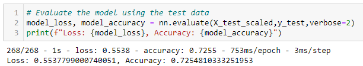

# Overview of the Analysis
This analysis documents the performance of the deep learning models I constructed using the Alphabet Soup dataset.

# Results
**I. Data Processing**

1. What variable(s) are the target(s) for your model?
* 'IS_SUCCESSFUL' column from application_df
2. What variable(s) are the features for your model?
* All other comlumns of application_df (except for the 'IS_SUCCESSFUL', 'EIN' and 'NAME' columns)

3. What variable(s) should be removed from the input data because they are neither targets nor features?
* EIN' and 'NAME' columns

**II. Compiling, Training, and Evaluating the Model**

1. How many neurons, layers, and activation functions did you select for your neural network model, and why?
* Attempt 1: 
    - Application type cut off = 500
    - Classification count cut off = 1800 
    - layer1 = 10 : activation = relu
    - layer2 = 20 : activation = relu

* Attempt 2: Doubled the hidden noteds of each layer
    - Application type cut off = 500
    - Classification count cut off = 1800 
    - layer1 = 20 : activation = relu
    - layer2 = 40 : activation = relu

* Attempt 3: Added one more layer
    - Application type cut off = 500
    - Classification count cut off = 1800 
    - layer1 = 10 : activation = relu
    - layer2 = 20 : activation = relu
    - layer3 = 30 : activation = relu

2. Were you able to achieve the target model performance? 
* No. I was not able to achieve the target model performance of 75% or higher accuracy
    - Attemp 1: Accuracy 72.69%

    - Attemp 2: Accuracy 72.56%

    - Attemp 3: Accuracy 72.55%

3. What steps did you take in your attempts to increase model performance?
* Attemp 2: Doubled the hidden nodes of each layer compared to the attempt 1
* Attemp 3: Added one more layer compared to the attempt 1 & 2

# Summary
Despite making several modifications to the neural network model, the accuracy fell short of the 75% target. The deep learning model's accuracy in predicting the classification problem remained below 73% in each of the three attempts.

